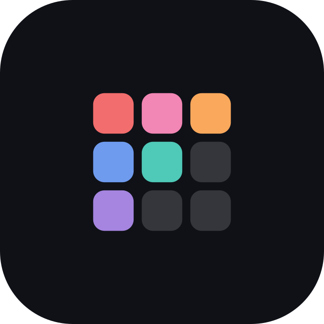
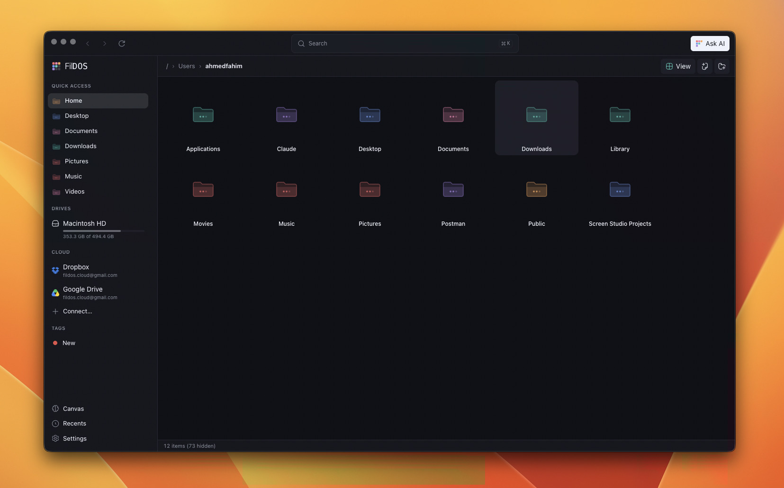
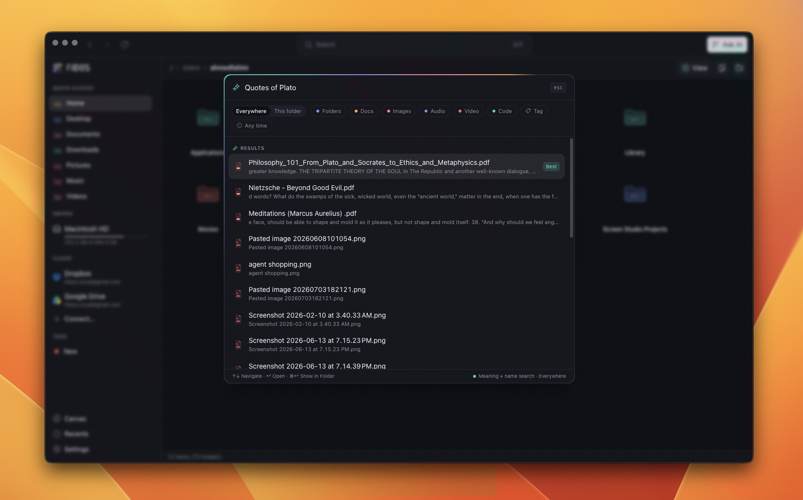
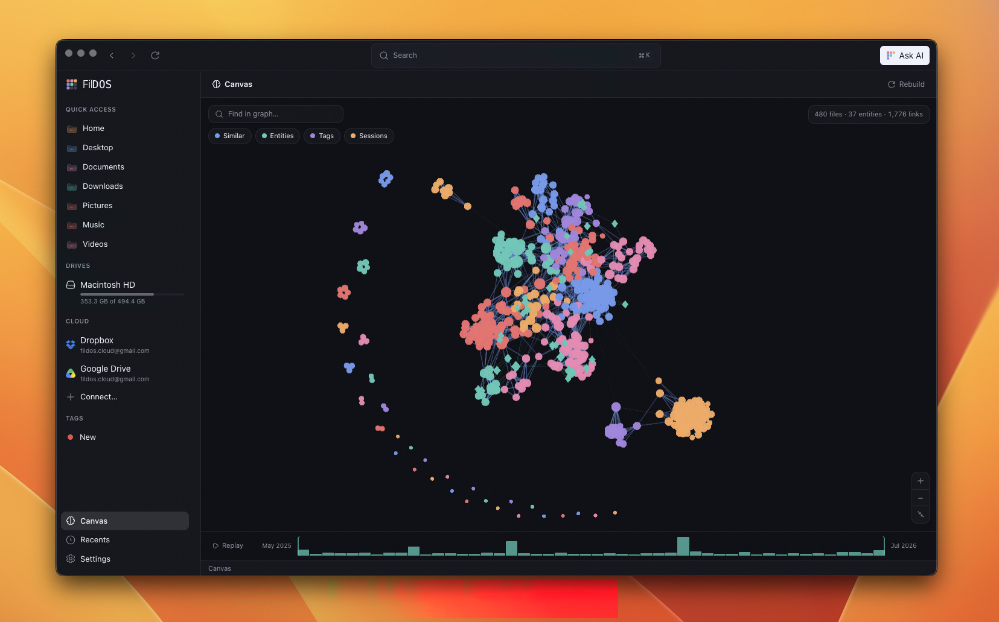
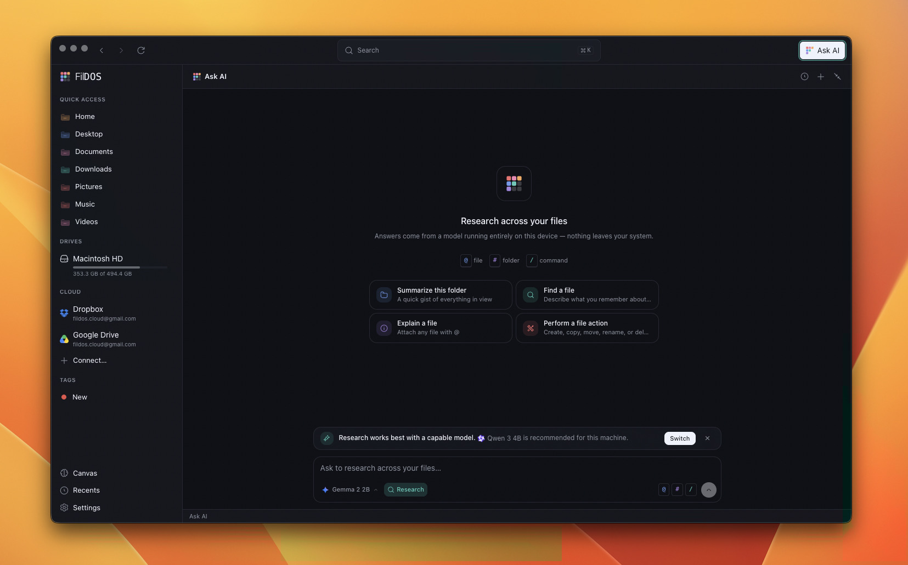

<p align="center">
  <picture>
    
  </picture>
</p>

<h3 align="center">Your files, finally connected</h3>

<p align="center">
  FilDOS is an Open-Source AI-native File Browser for your PC. Search by meaning, chat with your documents, and see how your work connects. All running locally on-device.
</p>

<p align="center">
  <a href="LICENSE">
    
  </a>
  <a href="https://github.com/ahmedfahim21/FilDOS/actions/workflows/ci.yml">
    
  </a>
  <a href="https://github.com/ahmedfahim21/FilDOS/releases">
    
  </a>
</p>

<p align="center">
  <a href="https://fildos.cloud">Website</a> ·
  <a href="https://docs.fildos.cloud">Docs</a> ·
  <a href="https://github.com/ahmedfahim21/FilDOS/issues">Issues</a> 
</p>

<p align="center">
  <video src="public/fildos.mp4"
        controls
        autoplay
        muted
        loop
        width="900"
        >
  </video>
</p>

## Why FilDOS

Cloud file-AI products require you to upload your files to use AI features. Every
document, photo, and note you hand over teaches someone else's model and sits
on someone else's servers.

FilDOS runs the other way around: the app, the index, and the models all live
on your personal machine. Embeddings, search, the knowledge graph, and the assistant
chat are computed on-device, nothing leaves your computer unless you
explicitly connect a cloud drive. The whole thing is MIT licensed, so the
privacy story is something you can read in the source, not something you have
to take on faith.

## What FilDOS does

- **A real file manager first.** List, grid, and gallery views, resizable
  columns, inline rename, drag-and-drop, undo, tags,
  recents, and per-folder view memory, the basics work before any AI does.
- **Search by meaning.** Ask for "receipts from tax season" or "photos from the
  Japan trip" and FilDOS finds files by what's in them, not just their names.
  Text, code, PDFs, DOCX, and images (via CLIP) are all indexed.
- **Private, on-device AI.** Indexing and embedding run locally over WASM;
  nothing is uploaded, and the index lives in a local database.
- **Chat with your files.** An on-device LLM (llama.cpp) that can `@file` and
  `#folder` mention your data, run `/find` searches, and act on files
  (create/move/rename/delete) with your approval, every exchange is saved so
  you can resume it later.
- **Canvas.** A GPU-rendered knowledge graph of your files, built from
  embedding similarity, extracted entities, and temporal sessions. A visual
  answer to "how does this connect to the rest of my work."
- **Your clouds, one window.** Browse Google Drive and Dropbox alongside local
  folders through the same interface, with more storage backends on the way.
- **Hide from AI.** Exclude specific files, folders, or extensions from
  indexing and chat so the assistant never sees what you don't want it to.
- **Bring your own model.** A built-in catalog of local models (Llama, Qwen,
  Gemma, Phi, Mistral, DeepSeek, and more), or paste any GGUF from Hugging
  Face, everything runs on your own hardware.

<table>
  <tr>
    <td width="25%"></td>
    <td width="25%"></td>
  </tr>
  <tr>
    <td align="center">File browser</td>
    <td align="center">Semantic search</td>
  </tr>
  <tr>
    <td width="25%"></td>
    <td width="25%"></td>
  </tr>
  <tr>
    <td align="center">Canvas</td>
    <td align="center">Ask AI</td>
  </tr>
</table>

## Repository layout

```text
src/            The desktop app: Electron main / preload / renderer
  shared/       Types and IPC channel names shared by every layer
  main/         Main process: filesystem, database, and the AI layer
  preload/      contextBridge: the only surface the renderer can call
  renderer/     The React app
docs/           Product docs (Mintlify)
website/        The landing site (Next.js)
```

A deeper tour of the architecture, the IPC contract, the database layer, and
each AI subsystem lives in [.claude/CLAUDE.md](.claude/CLAUDE.md).

## Getting started

FilDOS is pre-1.0 and doesn't have packaged installers yet, so running it
today means building from source.

### Prerequisites

- Node.js 22 or newer (required the app relies on `node:sqlite`, which needs
  Node 22 / Electron ≥ 35)
- npm

### Run the desktop app

```bash
git clone https://github.com/ahmedfahim21/FilDOS.git
cd FilDOS
npm install      # also installs the git pre-commit hook
npm run dev      # electron-vite dev server with HMR
```

Cloud-provider OAuth credentials (Google Drive, Dropbox) are optional and only
needed if you want to test those integrations locally. Copy `.env.example` to
`.env` and fill in the values.

### Build a production bundle

```bash
npm run build    # output in out/
npm start        # preview the production build
```

Check [Releases](https://github.com/ahmedfahim21/FilDOS/releases) for signed,
packaged builds once they're published.

## Development

```bash
npm run typecheck   # tsc for the node (main/preload) and web (renderer) projects
npm run lint        # eslint (flat config)
npm test            # vitest — unit and integration tests
npm run test:watch  # vitest in watch mode
npm run test:e2e    # build, then run the Playwright smoke test on the packaged app
```

Tests live beside the code as `*.test.ts`. The filesystem service tests are
true integration tests that exercise real files in a temporary sandbox. The
end-to-end test launches the built Electron app and asserts the shell boots;
on a headless Linux machine, run it under `xvfb-run`.

Please run `npm run lint`, `npm run typecheck`, `npm test`, and `npm run build`
before opening a pull request. CI runs lint, typecheck, unit/integration
tests, and the end-to-end smoke test on Ubuntu, macOS, and Windows. See
[CONTRIBUTING.md](CONTRIBUTING.md) for the full workflow.

## Tech stack

- Electron, React, TypeScript, electron-vite
- Tailwind CSS v4 and Radix primitives
- SQLite (`node:sqlite`) with Drizzle ORM
- `@huggingface/transformers` (WASM) for on-device embeddings and reranking
- `node-llama-cpp` for the on-device assistant chat
- `@cosmos.gl/graph` (GPU/WebGL) for the Canvas knowledge graph
- `opendal` for cloud storage backends
- Vitest and Playwright for testing

## Contributing

Contributions are welcome. Start with [CONTRIBUTING.md](CONTRIBUTING.md), and
note that this project follows a [Code of Conduct](CODE_OF_CONDUCT.md). Design
and UI work should follow [.claude/brand-guidelines.md](.claude/brand-guidelines.md).
Security issues should go through [SECURITY.md](SECURITY.md) rather than a
public issue.

## License

[MIT](LICENSE) © Fahim Ahmed
